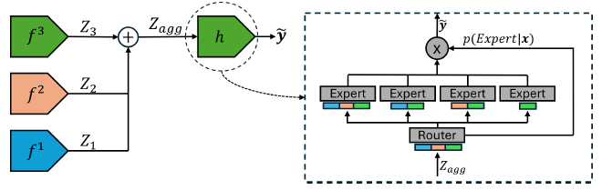

# Split-MoPE: Mixture of Predefined Experts for Vertical Federated Learning
 
[](https://arxiv.org/abs/2602.12708)
 
> Implementation of **Split-MoPE**, a communication-efficient, effective, and robust Vertical Federated Learning (VFL) approach that maximizes data usage even with partially aligned samples.
 
## 📋 Overview
 
**Split-MoPE** integrates **Split Learning** with a novel **Mixture of Predefined Experts (MoPE)** architecture to address critical challenges in Vertical Federated Learning:
 
| Challenge | Split-MoPE Solution |
|-----------|-------------------|
| ❌ Sample misalignment across participants | ✅ Predefined experts handle all possible data alignment patterns |
| ❌ High communication overhead | ✅ Single-round training with frozen pretrained encoders |
| ❌ Vulnerability to noisy/malicious participants | ✅ Router gating inherently limits influence of uninformative parties |
| ❌ Lack of interpretability | ✅ Per-sample contribution quantification via expert weights |
 
Unlike standard Mixture of Experts (MoE) where routing is learned dynamically, **MoPE uses predefined experts** to process specific data alignments that naturally arise in VFL scenarios, effectively maximizing data usage during both training and inference without requiring full sample overlap.
 
## ✨ Key Features
 
- 🔒 **Privacy-Preserving**: Raw data never leaves participant devices; only embeddings are exchanged
- 📡 **Communication Efficient**: Single forward pass per participant
- 🎯 **Alignment-Agnostic**: Works with any sample overlap pattern between participants
- 🛡️ **Robust**: Inherently limits impact of malicious or noisy participants 
- 🔍 **Interpretable**: Quantifies each collaborator's contribution to every prediction
 
## 🏗️ Architecture
 


*Figure: Split-MoPE workflow. Passive participants encode local data with frozen pretrained models and send embeddings in a single communication round. The active participant aggregates embeddings and routes them through predefined experts corresponding to observed alignment patterns. The sigmoid-based router enables collaborative, interpretable weighting of expert contributions.*
 
The **MoPE head** contains one expert per possible data alignment. During inference, the router dynamically weights expert outputs using sigmoid activation, enabling collaborative ensemble predictions.
 
## 📦 Repository Structure
 
```
Split-MoPE/
├── main_images_noisy.py      # Image experiments with malicious participants
├── main_images_non_noisy.py  # Image experiments (CIFAR-10/100)
├── main_tabular.py           # Tabular experiments (Breast Cancer Wisconsin)
├── utils.py                  # Helper functions
├── models/                   # Model definitions (encoders, MoPE head)
├── flower/                   # Flower framework integration for FL deployment
├── data/                     # Data helpers
├── LICENSE                   # Dual license
└── README.md                 # This file
```
 
## 🚀 Quick Start
 
### Installation
 
```bash
# Clone the repository
git clone https://github.com/ai-digilab/Split-MoPE.git
cd Split-MoPE
 
# Install dependencies
pip install -r requirements.txt
```
 
### Running Experiments
 
```bash
# CIFAR-10/100 image classification (non-noisy setting)
python main_images_non_noisy.py
 
# CIFAR-10/100 with malicious participants
python main_images_noisy.py
 
# Tabular data (Breast Cancer Wisconsin)
python main_tabular.py 
```
 
### Key Arguments
 
Modifying the following arguments of each script every experiment can be reproduced.
 
| Argument | Description | 
|----------|-------------|
| `dataset` | Dataset name: `cifar10`, `cifar100`, `breast_cancer` |
| `p_miss` | Probability of missing data per passive participant |
| `num_clients` | Total number of participants |
| `noisy_parties` | Noisy or malicious party indexes |
| `seed` | Random seed for reproducibility |
 
## 📚 Citation
 
If you use Split-MoPE in your research, please cite our paper:
 
```bibtex
@article{irureta2026mixture,
  title={Mixture of Predefined Experts: Maximizing Data Usage on Vertical Federated Learning},
  author={Irureta, Jon and Azkune, Gorka and Imaz, Jon and Lojo, Aizea and Fernandez-Marques, Javier},
  journal={arXiv preprint arXiv:2602.12708},
  year={2026}
}
```
